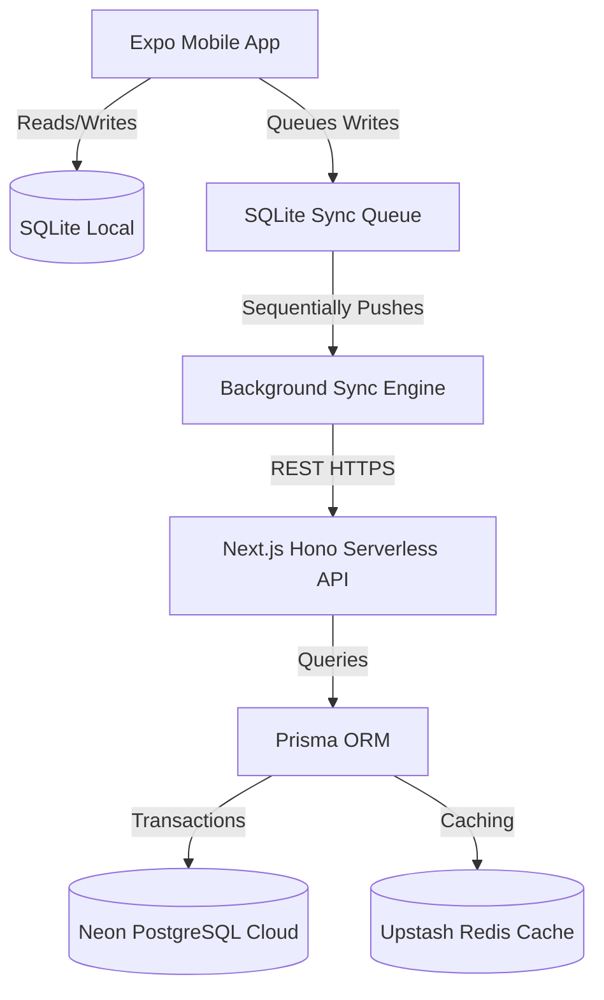

# BillDesk — System Architecture & Offline Sync

BillDesk uses a clean, decoupled client-server architecture. The mobile client functions as a standalone offline-first platform syncing logs with a remote Neon database instance.

---

## 🏛️ 1. Architecture Flow

---

## ☁️ 2. Multi-Shop Isolation Model

1. **Token Resolution:** The client passes a JSON Web Token (JWT) signed by the backend inside the headers.
2. **Context Binding:** The backend `authMiddleware` extracts this token, verifies it, extracts the user's `shopId` claim, and binds it to Hono request context variables.
3. **Database Scoping:** Controllers invoke backend services passing the resolved `shopId`. Repositories append `.findFirst({ where: { shopId } })` or `.updateMany({ where: { id, shopId } })` to make cross-tenant read/write accesses impossible.

---

## 🔄 3. Offline Sync Workflow

1. **Local Writes:** When a customer, invoice, or payment is saved in the app, SQLite inserts it locally, and updates `sync_queue` table with payload details.
2. **Connectivity Listener:** The `SyncEngine` checks internet connection and polls for pending records.
3. **HTTP Dispatch:** Pushes payloads sequentially to REST routes. On successful status (e.g. `200` or `201`), deletes item from `sync_queue`.
4. **Retry Loop:** Increases `attempts` counter and logs error responses on failure.
