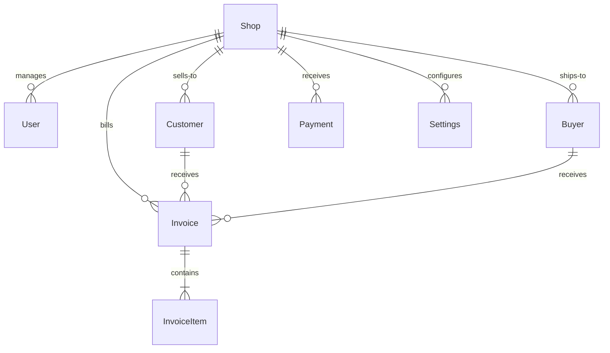

# BillDesk — Database Design & Indexing Guide

This document describes the design of the Neon PostgreSQL database schema, data relationships, and optimized indexes configured to support 100,000+ invoices and 10,000+ customers.

---

## 🏗️ 1. Entity Relationship Model (ERD)



---

## ⚙️ 2. Core Tables Schema

- **Shop:** Primary tenant model containing branding settings, address, language preferences, currency, and business category details.
- **Customer / Buyer:** Core trading parties, tracking custom `openingBalance`, `creditLimit`, and contact logs.
- **Invoice:** Main transaction log, aggregating derived financials (`subtotal`, `taxAmount`, `discountAmount`, `transportCharge`, `grandTotal`, `paidAmount`, `pendingAmount`, `paymentStatus`).
- **InvoiceItem:** Relational line-items containing unit descriptions and alternative packaging configurations (`alternativeQuantity`, `altUnit`).

---

## ⚡ 3. Index Optimizations

High-performance query filtering relies on custom composite indexes defined in the schema to ensure swift dashboard loading and search response:

```prisma
// Query scoping indexes
@@index([shopId])
@@index([invoiceNumber])
@@index([invoiceDate])
@@index([createdAt])
```

- **`shopId` Indexing:** Applied to `User`, `Customer`, `Buyer`, `Invoice`, `Payment`, and `Settings` tables. Enforces $O(1)$ tenant scoping checks, preventing full table scans on large cross-tenant databases.
- **Chronological Sorting Indexes:** `createdAt` and `invoiceDate` indexes allow sub-millisecond retrieval of recent ledger items for dashboards and reporting queries.
